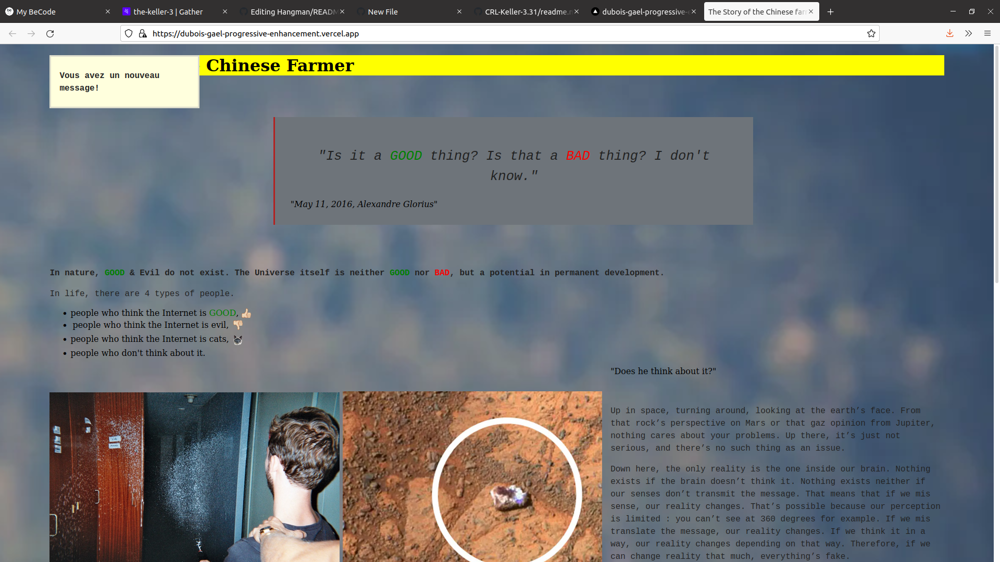
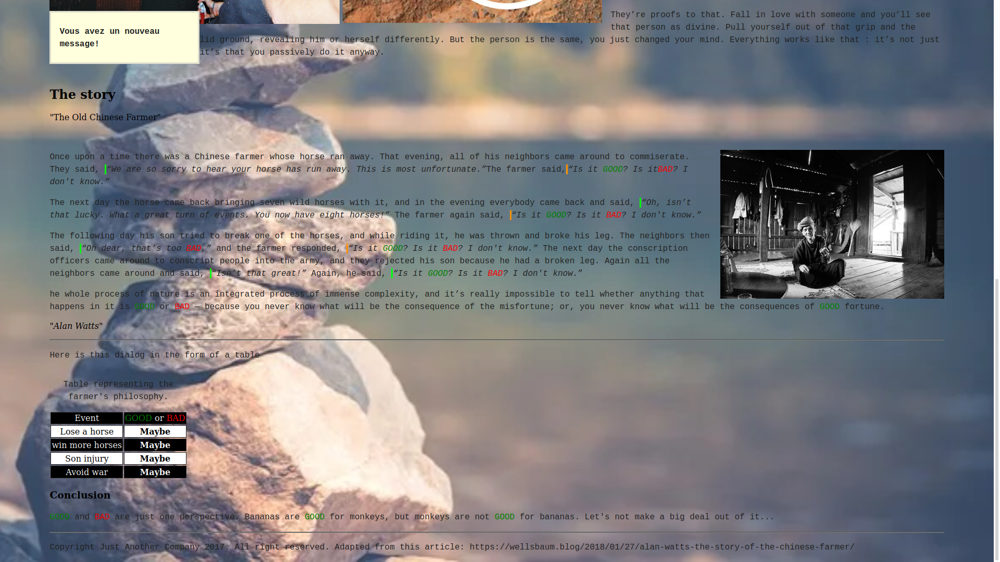

# Progressive-enhancement

# Hangman

## Project instructions

[https://github.com/becodeorg/CRL-Keller-3.31/blob/master/LearningPath/01.The-Field/04.HTML-CSS/0.progressive_enhancement/readme.md]

##About

follow the instructions step by step

## Screenshot

  

## See the project

You can view my project here [https://dubois-gael-progressive-enhancement.vercel.app/](https://dubois-gael-progressive-enhancement.vercel.app/)

## Auteurs
* **Gael Dubois**(https://github.com/DuboisGael)
